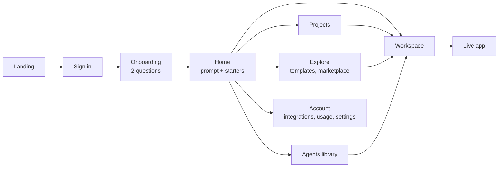
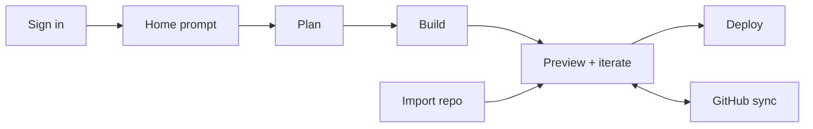
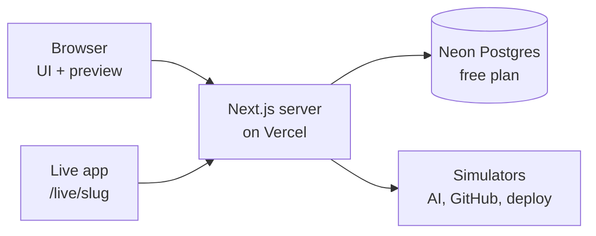

# Architect 2.0 — Product Spec

> Snapshot of the living spec doc, taken 25 Sep 2026 (doc revision 34). The source is a Claude Doc:
> https://claude.ai/code/artifact/b381f50f-abd1-4d20-bf96-997b0ac214a3
> Where this spec and the code disagree, `docs/handoff/00-context.md` § "Where the code differs from the spec" wins.

## Summary

Architect 2.0 is one workspace where anyone can describe an agentic app in plain words and take it all the way to a live URL: agents, UI, code, repo and deploy. The bet is one product at two depths. Non-technical builders never have to see code, and developers can drop into files, terminal, diffs and Git in the same project without switching tools.

What the submission has to prove, in the order Lyzr will judge it:

| Criterion | Weight | What we show |
| --- | --- | --- |
| Design, UI/UX and flows | Most important | One connected journey from landing page to live URL. Every screen has one obvious next step, and the design starts from user jobs rather than copying Architect or Lovable. |
| Feature coverage | High | Every flow builders and developers need: prompt to app, import, agents in any framework, GitHub and deploy, plus env vars, versions, data, logs and sharing. |
| Working functionality | Plus points | A real database for workspaces and projects, on free tiers. Everything that would call a paid or external service (sign-in, AI planning and building, GitHub, deploys, integrations) is a realistic simulation, so no API keys are needed and nothing costs money. |

What we hand in: a live Vercel URL and a public GitHub repo, sent through the hiring page's Submit tab.

## Research

Today's Architect already covers the non-technical journey from idea to deployed agentic app. 2.0 keeps every piece of it and adds the depth developers expect. The parity list below comes from the [Architect docs](https://docs.architect.new/llms.txt) as of [v2.2.0](https://docs.architect.new/changelog/v2-2-0) (7 Aug 2026).

### Current Architect: what must carry over

| Area | What Architect does today | What changes in 2.0 |
| --- | --- | --- |
| Getting started | [AI Consultant](https://docs.architect.new/introduction/platform/ai-consultant) (role, then bottlenecks, then your tools, then app ideas with hours saved), Prompt Library, [Marketplace](https://docs.architect.new/introduction/platform/agentlets) of apps you can clone | Kept. The Consultant becomes the "I don't know what to build" path on Home. |
| Context | [Attach files](https://docs.architect.new/introduction/platform/how-it-works): PDF/DOCX go to vector RAG, CSV/Excel to a dataframe agent. 45+ themes or your own design system (Figma, PDF, repo, zip). Import Studio agents. | Kept in the composer's + menu. Knowledge becomes its own panel you can inspect. |
| Planning | [Planning mode](https://docs.architect.new/build/planning-brainstorming) opens by itself: guided questions, then PRD, app mockup, workflow diagram, skill files and PDFs/decks. A [Plan toggle](https://docs.architect.new/build/plan-mode) for changes to an app that already exists. | Kept, merged into one Plan stage with a plan you can edit and a clear "Build this" step. |
| Build | [Plan, then agents, then UI](https://docs.architect.new/build/build-guide) (Next.js). Errors fix themselves. A testing agent checks the app in a browser and fixes it (adds 2 to 5 minutes). | Kept. The build shows as a visible timeline of steps; developers can expand it into diffs. |
| Agents | Lyzr Studio agents by default, [GitAgent](https://docs.architect.new/build/git-agents) beta (SOUL.md, RULES.md, skills/, memory/), 25+ integrations (Gmail, Slack, HubSpot, Notion, Jira and more), MCP servers, custom tools | Kept, plus a choice of framework per agent (see Users and principles). |
| Backend | [NoSQL database and auth generated automatically](https://docs.architect.new/build/database-auth), a Database tab, a separate database per app, an environment variables panel | Kept. Developers also get a schema view and a query console. |
| GitHub | [Connect, auto-commit, pull/push, switch branches](https://docs.architect.new/build/github-connect), import a Next.js repo, export to my GitHub | Kept. Import opens up beyond Next.js, and developers can review changes before they're committed. |
| Deploy | [Deploy without GitHub](https://docs.architect.new/build/deployment), rename the subdomain, custom domains, analytics toggle, publish to Marketplace, control over redeploys | Kept, plus preview and production environments, deploy logs and one-click rollback. |
| Account | [Plans and credits](https://docs.architect.new/introduction/essentials/plans-credits) (Free, then $20, $40 and $99 a month in credits, then Enterprise), credit breakdown per agent, sharing with teammates, in-app support | Kept |
| Artifacts | [Docs, decks and PDFs](https://docs.architect.new/build/artifacts) generated inside Build mode | Kept |

The gap is developers. The docs describe no code editor, terminal, review of changes before they land, or way to work locally, and import only takes Next.js repos.

### Reference platforms: what we take and what we avoid

These notes come from what we know of each product as of mid-2026, not fresh page reads.

| Platform | Why people use it | What we take | What we avoid |
| --- | --- | --- | --- |
| Lovable | The best-looking results for founders who don't code; a built-in backend | Click an element in the preview to edit it; a chat-only mode; a security scan before publishing | Tying the backend to one vendor |
| Bolt.new | A full Node environment running in the browser, and fast | A real file tree and terminal for developers | Showing raw stack traces to non-technical users |
| Replit | A full cloud IDE with Agent, database, secrets and deploy types | A checkpoint after every agent turn with one-click rollback; a Secrets panel | Throwing a dense IDE at newcomers on day one |
| v0 | Polished React and shadcn UI, deployed to Vercel in one click | A design mode for editing styles directly; a short path from preview to production | Doing frontend only |
| Emergent | Multi-agent builds of full-stack apps | Showing the agents at work (planner, builder, tester) | Long runs you can't see into |
| Rocket.new | Starting from Figma or templates, including mobile | Figma import as a starting point | Using templates as a crutch |
| Cursor | An AI-native IDE: agent, tab completion, rules | Accepting or rejecting changes per file; a project rules file | Assuming the user can code |
| Codex | Cloud tasks that run in parallel and end in a pull request | Background tasks that open a PR | Leaving out a live preview |
| Claude Code | An agent in the terminal: plan mode, CLAUDE.md memory, hooks, MCP | Planning before acting; asking permission before risky actions; a CLI for working locally | Offering nothing visual for non-technical users |

Three lessons shape 2.0. Every serious tool now separates thinking from doing. Developers trust diffs, checkpoints and Git, while non-technical users trust previews and plain-language status, so 2.0 should show the same event both ways. And owning the code (repo sync, export, local CLI) is what turns a toy into a tool.

## Users and principles

2.0 serves two users through one project model. They differ in how much of the machinery they see, never in what they can do.

| | The builder (non-technical) | The developer |
| --- | --- | --- |
| Who | Ops lead, founder, analyst, consultant. Knows the problem, not the stack. | Full-stack or AI engineer. Knows the stack and wants speed without giving up control. |
| Job to be done | "Turn my workflow into a tool my team can use this week." | "Ship an agent-backed app fast, in my framework, in my repo." |
| Starts from | An idea, a document, a template or the AI Consultant | A GitHub repo, a framework choice or a spec |
| Trusts | A live preview, plain-language progress, one-click undo | Diffs, logs, tests, Git history, control over env vars |
| Fears | Breaking things, jargon, surprise bills | Lock-in, code they can't see into, a proprietary agent runtime |
| Done means | A live URL shared with the team | A merged PR, a deploy from their own repo, green checks |

### Design principles

1. **One project, two depths.** Simple and Pro are views of the same project, not two products. The switch sits in the top bar, is remembered per person, and never loses work. Onboarding asks once ("Do you write code?") to pick the default.
2. **Theme is separate from mode.** Light, dark or system is its own toggle, because many developers work in light mode and some builders prefer dark.
3. **Think, then do, and always show which is happening.** The composer has a Plan / Build switch. A plan is a checklist you can edit, not a wall of chat.
4. **Every AI turn is a checkpoint.** Each turn leaves a named version. Simple shows a before/after thumbnail and Pro shows the diff. Undo is one click in both.
5. **Progress is steps, not a spinner.** The build runs as a timeline: Plan, Agents, Data, UI, Test, Ready. Simple sees the step names; Pro can expand each step into files and logs.
6. **Speak the user's language.** An error in Simple reads "The sign-up form can't save yet" with a single Fix button. The same error in Pro shows the stack trace and a link to the file.
7. **No lock-in.** The project is a standard repo at all times, agents use the framework you choose, and export or the CLI is always one step away.
8. **Show cost before you spend it.** Every build shows an estimate first and a breakdown by step afterward.
9. **Keyboard-first in Pro, pointer-first in Simple.** Cmd+K opens a command palette everywhere; Pro adds shortcuts for files, terminal and diffs.

## Information architecture

The product has twelve pages, and almost all real work happens on one of them: the Workspace. Everything else is a way in (Home, Explore, Projects) or account plumbing.



Every signed-in page shares a collapsible left rail (Home, Projects, Agents, Explore, Integrations, Usage). Settings and the theme toggle sit at the bottom of the rail. The Workspace hides the rail to give the preview room, and keeps the Simple/Pro switch in its own top bar.

| Page | Route | What's on it | Main action |
| --- | --- | --- | --- |
| Landing | / | Value proposition, a working prompt box, the two ways to start | Start building (the prompt you typed carries through sign-in) |
| Sign in | /login | Google, GitHub and email options (a dummy flow) | Continue |
| Onboarding | /welcome | Your role, "Do you write code?", an optional GitHub connect | Go to Home |
| Home | /home | The composer and its + menu; four starts: Describe it, Import a repo, Use a template, Ask the Consultant; recent projects | Send prompt |
| Projects | /projects | Every project with status (Draft, Live, Error), last deploy and framework; search and filters | Open project |
| Workspace | /p/[id] | Chat, preview and panels (see Workspace anatomy) | Build, Deploy |
| Agents | /agents | Every agent across projects; create one on its own; framework, tools, knowledge; test console | New agent |
| Explore | /explore | Templates, community marketplace, prompt library | Use template or Clone |
| Integrations | /integrations | GitHub, Vercel, Slack, Gmail and others; MCP servers; model API keys | Connect |
| Usage | /usage | Credits, broken down by project and by build step | Top up or upgrade |
| Settings | /settings | Profile, team, default mode, theme, CLI tokens | Save |
| Live app | [name].architect.app | The deployed app itself | (none) |

## Core flows

The main path takes five steps (prompt, plan, build, preview, deploy), with import and GitHub as side doors into the same Workspace.



### 1. Sign in and onboarding (dummy flow)

1. On Landing, the user types a prompt and clicks Start. The prompt is kept.
2. /login offers Continue with Google, Continue with GitHub, and Email. Each one plays a one-second mock consent screen; Email shows a "Check your inbox" screen with an Open demo link.
3. /welcome asks two questions as chips: role (Founder, Ops, Sales and Marketing, Engineer, Student, Other) and "Do you write code?" (Not really sets Simple, Yes sets Pro). A third step, Connect GitHub, can be skipped.
4. The user lands on Home with the prompt from step 1 already in the composer.

### 2. Home: starting a project

1. The composer is the hero, with rotating example prompts. The + menu holds Attach files (knowledge), Theme, Add agents, and, in Pro, Stack and Model.
2. Under it sit four starts: **Describe it**, **Import a repo**, **Use a template** and **Ask the Consultant**.
3. The Consultant path asks three questions (role, biggest time-sinks, tools used), then shows three app ideas with estimated hours saved. Picking one fills the composer.
4. Sending creates the project and opens the Workspace in the Plan stage.

### 3. Plan

1. The chat asks two to four clarifying questions as tappable chips. The user can answer, type, or pick Skip questions.
2. The right panel fills a live Plan with Overview, Pages, Agents (name, role, framework, tools, model), Data, Integrations and an Estimate (credits and minutes). Tabs switch to Mockup and Agent flow.
3. Every line of the plan can be edited in place or changed through chat.
4. **Build this** is the single primary button. Skip planning is a quiet link in the composer. In Pro, the plan also lists the stack and the files it will create.

### 4. Build

1. The chat turns into a step timeline: Plan locked, Agents, Data, UI, Test, Ready. Each step ticks off with a one-line result ("Created 3 agents").
2. The preview shows a skeleton first, then the live app as soon as the first screen renders.
3. In Pro, the Code tab streams each file as it's written. Stop is always visible, in both modes.
4. At the end, a "What I built" card lists pages, agents and data, with three suggested next steps as chips. Version v1 is saved.

### 5. Iterate

1. **Chat:** Plan / Build switch in the composer. Plan answers without touching code.
2. **Visual edit:** clicking an element in the preview opens a small popover with a prompt field and style controls (text, emphasis, size).
3. **Review changes (Pro):** with the review setting on, each change arrives as a per-file diff to accept or reject before it's applied.
4. **Versions:** every turn saves a version. The Versions panel shows thumbnails in Simple and diffs in Pro; Restore is one click.
5. **Errors:** a banner on the preview. Simple gets a plain sentence and a Fix it button; Pro gets the stack trace, the file link and Fix it.

### 6. Agents

1. The Agents panel lists the agents from the plan, and a flow view shows who hands off to whom.
2. Agent detail has Instructions, Model, Tools (integrations and MCP), Knowledge (files), Memory and Guardrails.
3. **Framework** is set per agent: Lyzr (hosted, the default), LangGraph, CrewAI, OpenAI Agents SDK, Claude Agent SDK, Google ADK, Mastra or GitAgent. In Pro, switching framework shows the generated agent code.
4. **Test console:** chat with one agent on its own and see its trace (tool calls, tokens, latency).
5. /agents can also create a standalone agent with no app around it, exposed as an API endpoint and an embeddable chat widget.

### 7. Import an existing project

1. Sources: a GitHub repo (the list of your repos appears after connecting), a Git URL, or a ZIP. An "exported from Lovable, v0 or Bolt" hint points those users to GitHub.
2. The user picks a repo and branch. Architect scans it and shows an Analysis card, for example: "Next.js 14 app · 42 files · uses Prisma · needs 3 env vars".
3. The user fills the missing env vars, or skips them for now.
4. The Workspace opens with a preview and a first message: "I've read your project. Here's how it's organised. What should we change?"

### 8. GitHub

1. The GitHub button in the Workspace top bar starts OAuth if you aren't connected yet.
2. The user creates a new repo (name, private or public) or links an existing one. The first push follows. Linking a repo that already has code puts the project on its own branch, so that repo's main stays untouched until a pull request merges it.
3. After that, the top bar shows sync status, for example "main · synced 2m ago". Auto-commit is on by default in Simple. Pro defaults to commits written from the diff review.
4. The panel has a branch switcher, Pull, Push, and **Open PR**, which turns the latest change into a pull request.

### 9. Deploy

1. **Deploy** is always in the top-right of the Workspace. Clicking it opens a side sheet.
2. A pre-flight checklist runs: build passes, env vars set, no secrets in client code, agents reachable. Anything that fails links to its fix.
3. Settings: subdomain (checked for availability), environment (Preview or Production), custom domain (DNS instructions), analytics, Publish to Marketplace.
4. Clicking Deploy streams its steps (Building, Uploading, Assigning domain). On success the sheet shows the URL, a QR code, share buttons and the version number.
5. The Deployments tab keeps the history with logs and a one-click Rollback. In Pro, each branch can get its own preview deploy.

### 10. Share and collaborate

1. Share in the top bar invites people by email as Viewer or Editor, or copies a preview link.
2. Comments can be pinned to elements in the preview so teammates can leave feedback without chatting to the agent.

## Workspace anatomy

The Workspace is one screen: a conversation on the left and a stage on the right. Pro adds a code tab and a bottom drawer to the same layout; it never swaps to a different layout.

```
+--------------------------------------------------------------------------+
| < Projects / Lead Nurturer v    [Simple | Pro]   main . synced   Share  [Deploy] |
+------------------------+-------------------------------------------------+
| Build timeline         | Preview  Plan  Agents  Data  Code*  Versions  Settings |
| Messages               |                                                 |
|                        |        live app   [desktop | tablet | mobile]   |
|                        |                                                 |
| +--------------------+ +-------------------------------------------------+
| | Composer Plan|Build | | * Pro: Terminal . Logs . Problems (drawer)     |
+-+--------------------+-+-------------------------------------------------+
```

**Top bar:** project name (click to rename), Simple/Pro switch, GitHub sync status, Share, and Deploy as the only filled button.

**Chat panel:** resizable from 320 to 520 px, and collapsible with Cmd+\ to put the preview in focus. On mobile, Chat and Preview become two tabs.

**Stage tabs:**

| Tab | What it does | Shown in |
| --- | --- | --- |
| Preview | The running app; route bar, device sizes, refresh, open in new tab, visual edit | Both |
| Review | A pending change as per-file diffs with a commit message; appears only while one is waiting | Pro, with review on |
| Plan | The living PRD, updated as the app changes | Both |
| Agents | Agent list, handoff flow, detail, test console | Both |
| Data | Collections and rows; in Pro, schema and a query console too | Both |
| Code | File tree, editor, search, diffs | Pro (Simple has View code in the overflow menu) |
| Versions | Every checkpoint, with Restore | Both |
| Settings | Env vars and secrets, domain, GitHub, integrations, delete project | Both |

**What changes between the modes:**

| Element | Simple | Pro |
| --- | --- | --- |
| Build progress | Step names | Each step expands into files and logs |
| Applying changes | Automatic, with thumbnail versions | Optional diff review and commit messages |
| Errors | A plain sentence and a Fix it button | Stack trace, file link and Fix it |
| Agents | Instructions in plain English, switches for tools | Framework picker, agent code, traces |
| Data | A spreadsheet view | Schema and a query console |
| GitHub | Auto-commit | Branches, PRs, manual commits |
| Deploy | One button behind a checklist | Environments, preview deploys per branch, logs |
| Composer | Attach files, theme | @file mentions, /commands, model picker |
| Bottom drawer | Hidden | Terminal, Logs, Problems |

## Feature matrix

There are 39 features: 16 must-haves, 16 should-haves and 7 nice-to-haves. 16 work for real, 3 partly, and 20 are simulated flows that show the full experience. None of them needs an API key. All 39 get built, must-haves first.

Real means it works end to end. Partly real means the UI and data are real but one step is faked. Dummy means a scripted flow that shows the whole experience.

### Start, plan and build

| Area | Feature | Priority | Build | Notes |
| --- | --- | --- | --- | --- |
| Start | Landing page with a working prompt box | P0 Must | Real | The prompt carries through sign-in |
| Start | Sign in with Google, GitHub or email | P0 Must | Dummy | Mock consent screens, since you don't need real auth |
| Start | Onboarding and default mode | P0 Must | Real | Saved to the database |
| Start | Home composer and + menu | P0 Must | Real | |
| Start | AI Consultant | P1 Should | Dummy | Three answers map to scripted app ideas |
| Start | Templates and marketplace | P1 Should | Partly real | Templates start real projects; the marketplace is a gallery |
| Start | Prompt library | P2 Nice | Real | A fixed, curated list |
| Plan and build | Clarifying questions and the living plan | P0 Must | Dummy | A scripted plan, streamed in section by section |
| Plan and build | Agent flow diagram | P1 Should | Real | Drawn from the plan |
| Plan and build | App mockup | P2 Nice | Dummy | |
| Plan and build | Build timeline with streaming | P0 Must | Real | |
| Plan and build | Live preview with device sizes | P0 Must | Real | Runs the generated code in the browser |
| Plan and build | Plan / Build switch | P0 Must | Real | |
| Plan and build | Versions and restore | P0 Must | Real | A snapshot per turn |
| Plan and build | Visual edit (click to edit) | P1 Should | Dummy | A scripted edit to the selected element |
| Plan and build | Error banner and Fix it | P1 Should | Dummy | A scripted error with a scripted fix |
| Plan and build | Testing agent | P2 Nice | Dummy | |

### Agents, code and shipping

| Area | Feature | Priority | Build | Notes |
| --- | --- | --- | --- | --- |
| Agents | Agents panel, detail and framework picker | P0 Must | Partly real | Config is saved and code generated per framework; agents don't run on those frameworks |
| Agents | Agent test console with trace | P1 Should | Dummy | Scripted replies with a realistic trace |
| Agents | Integrations and MCP catalog | P1 Should | Dummy | |
| Agents | Knowledge files | P1 Should | Dummy | The upload list only |
| Agents | Standalone agent with API and widget | P2 Nice | Dummy | |
| Data | Data tab and query console | P1 Should | Dummy | Seeded sample rows |
| Code and Git | Code tab: file tree, editor, diffs | P0 Must | Real | |
| Code and Git | Diff review before applying | P1 Should | Real | |
| Code and Git | Import a GitHub repo, with analysis | P0 Must | Dummy | |
| Code and Git | Import from ZIP or Git URL | P2 Nice | Dummy | |
| Code and Git | GitHub connect, create repo, push | P0 Must | Dummy | |
| Code and Git | Branches, pull, Open PR | P1 Should | Dummy | Simulated branches, pull, push and pull requests |
| Code and Git | Terminal, logs and problems drawer | P1 Should | Dummy | A scripted shell |
| Code and Git | Local CLI | P2 Nice | Dummy | A docs page with commands |
| Ship | Deploy sheet with checklist and logs | P0 Must | Partly real | Publishes a real snapshot URL; custom domains are faked |
| Ship | Deployment history and rollback | P1 Should | Real | |
| Ship | Env vars and secrets | P1 Should | Real | Stored per project, masked in the UI |
| Ship | Share and preview comments | P2 Nice | Dummy | |
| Account | Projects list | P0 Must | Real | |
| Account | Usage and credits | P1 Should | Dummy | Simulated token counts and billing |
| Account | Settings, theme and mode | P0 Must | Real | |
| Account | Command palette (Cmd+K) | P1 Should | Real | |

## Technical architecture

The whole thing is one Next.js app on Vercel with a free Neon Postgres database. Everything that would normally call a paid or external service is simulated inside the app, so there are no API keys and running it costs nothing.



The simulators are part of the app's own code. They return scripted output with realistic timing, so every flow can be shown end to end without spending anything.

### Stack

| Layer | Choice | Why |
| --- | --- | --- |
| App | Next.js 16 (App Router) and TypeScript on Vercel | The host you picked; UI, server actions and streaming in one repo |
| UI | Tailwind CSS v4, shadcn/ui (Radix), lucide icons, next-themes | Accessible building blocks; one token set drives both light and dark |
| Code editor | CodeMirror 6 | Editing and syntax colors that follow light and dark; version diffs come from jsdiff |
| Preview | Scripted demo apps rendered in a sandboxed frame | Behaves like a live preview; calls no outside service |
| Diagrams | React Flow | The agent flow view |
| Command palette | cmdk | Cmd+K |
| Database | Neon Postgres (Vercel Marketplace) in production, embedded PGlite locally, Drizzle ORM | Free plan: 100 projects, 0.5 GB each, no credit card ([Neon pricing](https://neon.com/pricing)). Local development needs no account at all. |
| AI | A scripted simulator | Plans, files and edits stream in with realistic timing; no API key, no cost |
| GitHub | Simulated connect, repo list, import and push | No OAuth app or token needed |

### Identity without sign-in

Signing in (simulated) creates a workspace and stores its random ID in an httpOnly cookie, and every row carries that ID. A workspace is never looked up by email, because an unverified email must not unlock anyone's data. The trade-off: clearing cookies loses the workspace.

### Data model

| Table | Holds |
| --- | --- |
| workspaces | Display name, role, default mode, theme |
| projects | Name, slug, status, stack, source (prompt, template or import), linked repo, plan JSON |
| messages | Chat history per project, tagged plan, build, chat or system |
| versions | A full file snapshot per turn, with a one-line summary |
| agents | Name, role, framework, model, instructions, tools; the project is optional so agents can stand alone |
| deployments | Version, slug, environment, status, log lines |
| env_vars | Key and masked value, per project |
| usage | Simulated tokens and cost for each build step |

### How the simulations work

1. **Plan:** the prompt is matched to the closest template by keywords, or to a generic app shape. A plan (questions, pages, agents, data, integrations, estimate) is generated from it and streamed in section by section.
2. **Build:** a scripted timeline streams files into the Code tab one at a time with realistic pauses. The preview switches on when the UI step finishes.
3. **Edits:** common requests (colors, copy, adding a section or a filter) map to scripted changes that produce a real diff and a new version. Anything else gets a plausible generic change.
4. **Errors and fixes:** some builds include a scripted error, so the Fix it flow can be shown.
5. **Agents:** the test console replies with scripted answers and shows a realistic trace (tool calls, tokens, latency).
6. **GitHub and deploy:** connect, import, push, branches, pull requests and deploys play out their steps with logs. Each one has a success state and a failure state.

### Cost

Nothing in the app calls a paid service. Vercel's free Hobby plan and Neon's free plan cover hosting and the database, and the usage and credit numbers in the UI are simulated.

## Build plan and open questions

The build runs in seven milestones. Each one leaves a working, deployable app, so if time runs out we cut from the end, never from the middle.

| # | Milestone | What ships |
| --- | --- | --- |
| 1 | Foundation | Design tokens (light and dark), app shell, Neon schema, workspace cookie, Landing, Sign in, Onboarding, Home, Projects |
| 2 | Plan and build | Simulated planning, streamed build, Sandpack preview, Code tab, versions, Plan / Build switch, timeline |
| 3 | Iterate | Edits with diff review, error Fix it, visual edit, Simple vs Pro differences, Cmd+K |
| 4 | Agents | Agents panel, framework picker with generated code, test console, agent runtime route, standalone agents, integrations catalog |
| 5 | GitHub | Simulated connect, repo list, import with analysis, push and branches |
| 6 | Ship | Deploy sheet, live URLs, deployment history and rollback, env vars, Usage, Settings |
| 7 | Polish and submit | The remaining dummy flows, empty/loading/error states, mobile layout, a seeded demo project, a README that walks through the flows, Vercel deploy, submission |

### What I need from you

- [x] A GitHub repo: sukulbagai/architect-2, private for now; make it public when you submit
- [ ] When we deploy: a Vercel account with a free Neon database added from its Storage tab. No card and no API keys.

### Open questions

1. **Deadline:** when is the submission due? It sets how much polish the last milestone gets.
